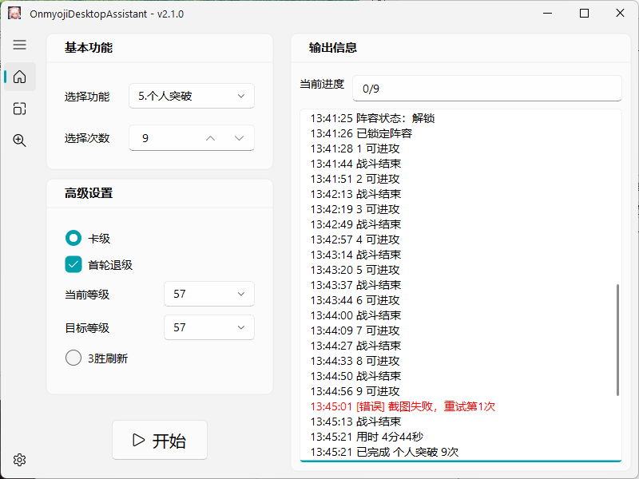
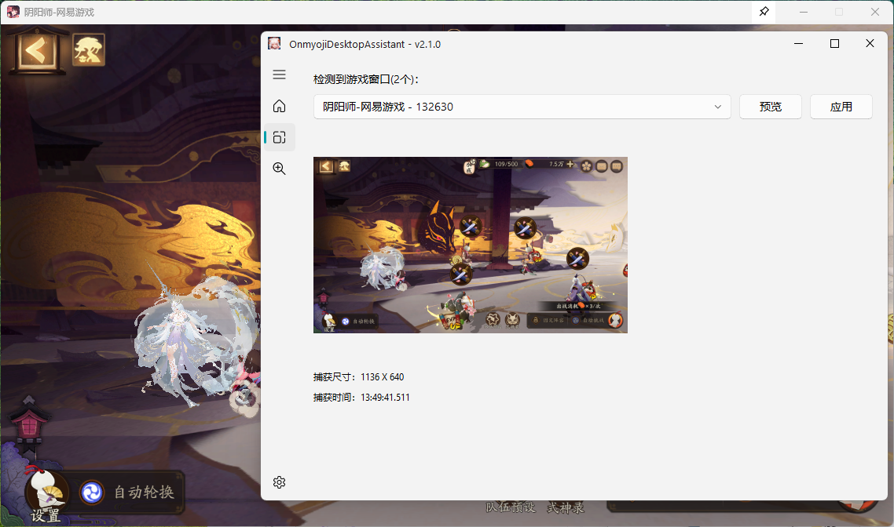
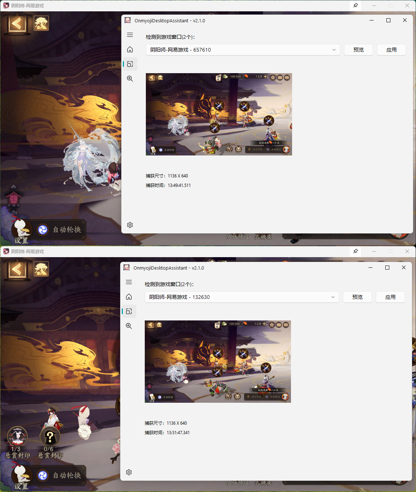

<div align="center">


# OnmyojiDesktopAssistant

<div>
    
    <a href="https://github.com/AquamarineCyan/OnmyojiDesktopAssistant/releases/latest"></a>
</div>

</div>

## 简介

本项目仅支持阴阳师桌面版使用，支持前台交互和后台交互模式。

## 帮助文档

[帮助文档](https://docs.qq.com/doc/DZUxDdm9ya2NpR2FY)

[交流群](https://qm.qq.com/q/T5pnZ5tGAs)

## 主要功能

1. 御魂副本
   - 十层/悲鸣/神罚
   - 组队/单人
   - 组队司机/打手
2. 组队永生之海副本
    - 适配司机/打手
3. 业原火副本
4. 御灵副本
5. 个人突破
    - 卡级/退级
    - 3胜刷新
6. 寮突破
    - 90%进度提前结束
7. 道馆突破
    - 等待系统进入/手动挑战/正在进行中
    - 仅支持挂机阵容
8. 普通召唤
    - 十连灰票
9. 百鬼夜行
    - 清票
10. 限时活动
    - 仅适用于月度活动的爬塔，支持体力爬塔300次/周年庆999次
11. 日轮副本
    - 组队/单人
    - 组队司机/打手
12. 单人探索
    - 准备自动轮换
    - 自动拾取结束后的掉落宝箱
13. 契灵
    - 探查
    - 结契
14. 觉醒副本
15. 六道之门速刷
    - 目前仅适配：椒图，4柔风，不打星之子的阵容，需要手动勾选“不再提醒”
16. 斗技自动上阵
    - 挂机阵容，自动上阵
17. 英杰试炼
    - 源赖光/藤原道长
    - 经验本/技能本
18. 绘卷刷分
    - 采用单人探索+个人突破的组合方式
19. 每周秘闻
    - 自动准备
---

- [x] 全局悬赏封印
- [x] 记忆上次所选功能
- [x] 识别多种战斗主题
- [x] 支持后台交互 :sparkles:
- [x] 有效词条分析
- [x] 游戏窗口管理


## 使用方法

### 1. 安装桌面版

 - 旧版桌面版
   - [NGA下载地址](https://nga.178.com/read.php?tid=29661629)
 - 新版桌面模拟器，通过官方MuMu专版下载，支持新区账号登录
   - [阴阳师桌面模拟器](https://yys.163.com/zmb/)
   - [【阴阳师】幼教级新桌面版安装及多开教程](https://www.bilibili.com/video/BV1rEUiBdEL6)
 - 新版与旧版仅窗口名称区别，其余功能一致。


###  2. 运行本软件

  1. 前往 [releases](https://github.com/AquamarineCyan/OnmyojiDesktopAssistant/releases/latest)
  2. 下载最新压缩包 `OnmyojiDesktopAssistant-2.x.x.zip`
  3. 解压到英文路径，双击 `OnmyojiDesktopAssistant.exe` 运行。


### 3. 源码编译运行（不推荐）

<details><summary> 需要自行安装 Python 环境 </summary>

1. 下载源码  

    ```bash
    git clone https://github.com/AquamarineCyan/OnmyojiDesktopAssistant.git
    ```

2. 安装依赖

    安装 uv：[uv 官方文档](https://docs.astral.sh/uv/getting-started/installation/)

    ```bash
    # 使用 uv 安装依赖
    uv sync

    # 使用 pip 安装依赖
    pip install -r requirements.txt
    ```

    可选：GPU 安装（手动，非默认）

    如果需要使用 GPU 加速，请在安装前先卸载 CPU 版 Paddle（如果已安装）：

    ```bash
    # 使用 uv 卸载 CPU 版本
    uv pip uninstall -y paddlepaddle

    # 使用 pip 卸载 CPU 版本
    pip uninstall -y paddlepaddle
    ```

    根据你的 CUDA 版本安装 paddlepaddle-gpu（以 cu129 为例），更多信息请参考 PaddleOCR 官方文档：https://www.paddleocr.ai/latest/quick_start.html#1

    ```bash
    # 使用 uv 安装 gpu 依赖
    uv pip install paddlepaddle-gpu==3.3.1 -i https://www.paddlepaddle.org.cn/packages/stable/cu129/

    # 使用 pip 安装 gpu 依赖
    pip install paddlepaddle-gpu==3.3.1 -i https://www.paddlepaddle.org.cn/packages/stable/cu129/
    ```

    建议在独立虚拟环境中安装 GPU 版本，避免与 CPU 版本冲突。

3. 运行/调试

    - 使用 **管理员权限** 启动IDE，如 `VSCode` 或者 `PyCharm` 。

    - 如果使用 `VSCode` 调试，已经提供了对应的调试文件，选择 `Project` 调试模式启动。

    - 其他方式启动：
      ```bash
      # 使用 uv 运行
      uv run python main.py

      # 使用 pip 运行
      python main.py
      ```

4. 打包

    打包配置保存在 `main.spec` ，打包时会根据构建环境是否已安装 `paddlepaddle-gpu` 自动收集对应的 GPU 动态库。

    使用 `build.bat` 打包。打包完成会在当前目录下生成 `output` 文件夹。

</details>

## 程序目录

```
|- OnmyojiDesktopAssistant # 根目录
   |- data # 用户数据
      |- myresource # 自定义素材，用法见 [#注意事项](#注意事项)
      |- screenshot # 截图（百鬼夜行结束会生成）
      |- config.yaml # 配置文件
      |- update_info.json # 更新记录
   |- lib # 运行库
   |- log # 日志
   |- models # 文字识别模型库
   |- resource # 素材文件
   |- resource_ja # 日服素材文件（可选）
   |- OnmyojiDesktopAssistant.exe # 主程序
```

## 主界面



## 后台交互模式

使用后台交互模式可以释放鼠标的使用，同时保证游戏不能被最小化，允许被其他应用遮挡。

验证是否可以正常使用后台交互模式：
1. 启动本软件。
2. 切换到 `设置` 页签，勾选 `后台` 交互模式。
3. 切换到 `窗口管理` 页签，点击 `预览` 按钮，能够显示游戏窗口截图，表明可以正常使用后台交互模式。
4. 如果游戏窗口截图为黑屏，在 `设置` 页签切换 `后台截图模式` 后重试。如果所有的截图模式都显示黑屏，请改为 `前台交互模式`。




## 多开

启动多个本软件可以实现多开，但需要手动设置每个软件检测的窗口。推荐启用 `后台交互模式` ，避免多个软件互相争夺鼠标控制。

1. 启动多个游戏窗口。
2. 启动多个本软件，按照 `后台交互模式` 配置后台功能，并确保后台正常使用。
2. 切换到 `窗口管理` 页签，点击 `预览` 按钮，选择对应窗口，确认每个软件检测到对应的游戏，并点击 `应用` 按钮。




## 日服

**素材迭代速度赶不上游戏UI迭代速度，欢迎提供最新版本的素材。**

1. 日服资源文件随压缩包一同提供，由 `GitHub Actions` 自动合并。
2. 软件设置 - `游戏服务器`  改为 `日服` ，重启。
3. 无报错信息即可使用。
4. 目前仅适配 `单人御魂副本` ，资源及测试由 [@huahua1125](https://github.com/huahua1125) 提供。

## 注意事项

**请自行合理使用，所产生的一切后果自负**

1. 基于图像识别和文字识别，支持多种战斗主题，建议游戏窗口不要过小，推荐强制缩放。

2. 推荐在功能界面开始任务。例如组队御魂类副本，在组队房间内开始任务。

3. 移动游戏窗口后，会自动更新窗口。

   多开游戏窗口，需要手动点击`游戏检测`，会检测位于较上层的游戏窗口。

   针对常见`1920*1080`分辨率下的非100%缩放，可修改游戏路径下的`Launch.exe`属性，避免每次强制缩放
   ```bash
   属性 - 兼容性 - 更改高DPI设置 - 替代高DPI缩放行为为`应用程序`
   ```

4. 如果需要自定义识别的素材，可参考 `resource` 下的分类方法，在 `/data/myresource` 给出相同路径的素材即可。

    例如需要使用自定义的 `/resource/huodong/title.png` 文件，则新建 `/data/myresource/huodong/title.png` 即可。程序将优先使用用户给定的自定义素材。

## 感谢

[PaddlePaddle/PaddleOCR](https://github.com/PaddlePaddle/PaddleOCR) 文字识别库

[zhiyiYo/PyQt-Fluent-Widgets](https://github.com/zhiyiYo/PyQt-Fluent-Widgets/tree/PySide6) 基于 PySide6 的 Fluent Design 风格组件库

[打包PaddleOCR项目](https://www.paddleocr.ai/latest/version3.x/inference_deployment/others/packaging.html) Paddle官方打包demo

## 声明

- 本软件采用 **GNU General Public License v3.0** 许可证。详见 [LICENSE](LICENSE) 文件。

- 本软件开源、免费，仅供学习交流使用。若您遇到商家使用本软件进行代练并收费，可能是设备与时间等费用，产生的问题及后果与本软件无关。

- 收费商家：闲鱼用户 [小段爱玩阴阳师](https://www.goofish.com/personal?userId=3933099288)

    

## 更新记录

[CHANGELOG.MD](CHANGELOG.MD)
